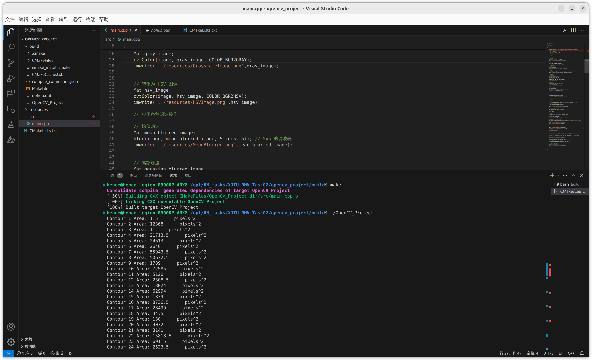

# XJTU-RMV-Task02

## 任务过程：

- 安装 opencv 4.6.0

- 构建项目结构

- 编写CMakeLists.txt

- 编写程序，尝试运行

  - 出现错误：symbol lookup error: /snap/core20/current/lib/x86_64-linux-gnu/libpthread.so.0: undefined symbol: __libc_pthread_init, version GLIBC_PRIVATE

    尝试更换系统自带的libpthread.so.0文件，依然报错：

    检查系统glibc版本，GLIBC 2.35；libpthread.so.0仅支持到2.31

    尝试从浏览器重新安装VScode：

    问题解决，程序正常运行，无报错（猜想应该是VScode在ubuntu软件商店里面的版本问题）

- 成功运行，保存结果

## 结果：

- 终端的输出截图

- 关于计算轮廓的面积结果的文件放在   opencv_project/build/nohup.out

（这个README.md文件本来应该放在opencv_project文件里面的，但是便于方便在github里面直接查看，于是放出来了）

